# Duplicati

# Requirements
- Docker
- Docker-compose
- traefik as a reverse proxy in front of it

# Setup
## `.env` file
Change the domain and the time zone in the `.env`.
```yaml
DOMAIN="example.com"
TimeZone='Europe/Berlin'
```
```sh
$ cd duplicati
$ docker-compose up -d
```
or
```sh
./docker.sh -S duplicati -r
```

Done. Now open https://backup.example.com\
Click no if you have a password infront of Duplicati. Like Authelia does.
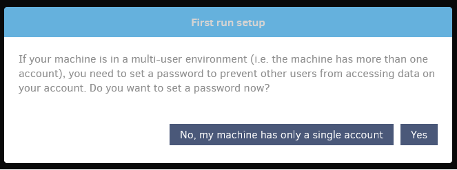
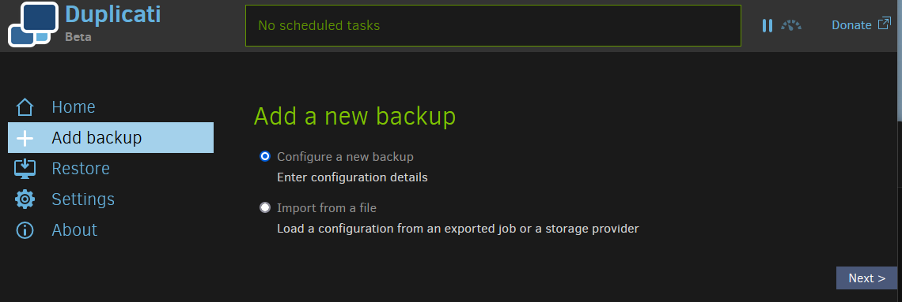
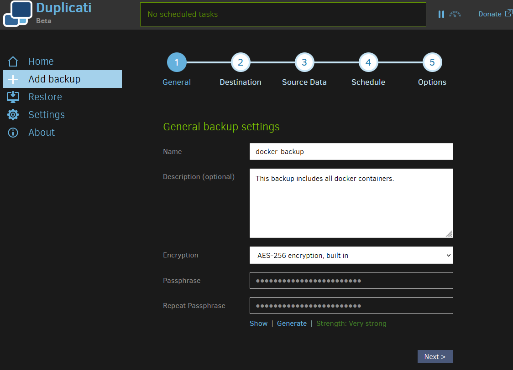
Chose your preferred backup destination type. There is a lot to choose from. I chose onedrive. Then cklick on the word `AuthID`. It will redirect you to a new page where you have to login into onedrive.\
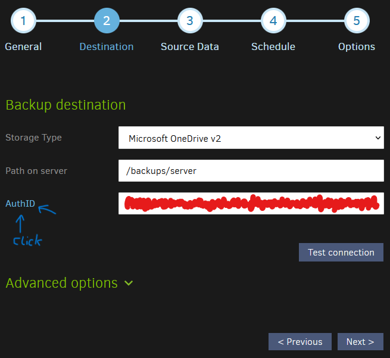
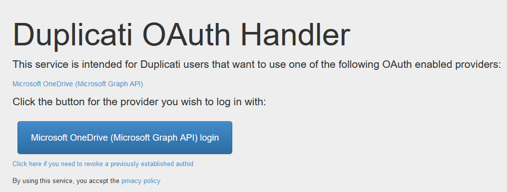
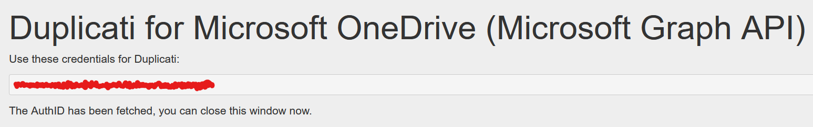
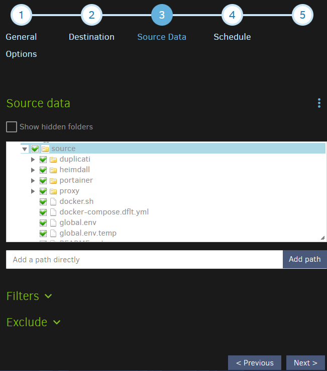
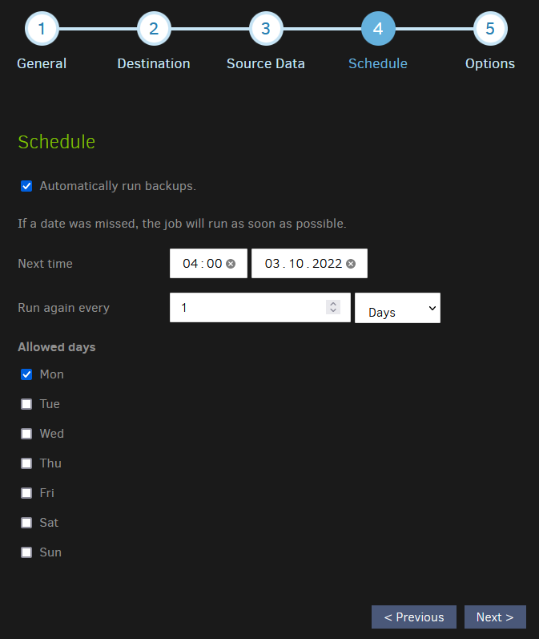
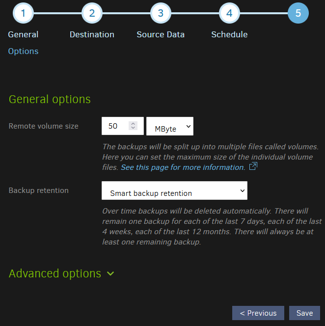

## Start a backup
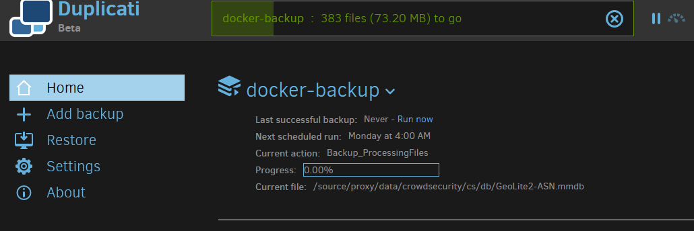
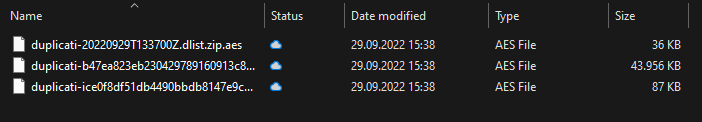
The backup will automaticly uploaded to the cloud. It will also be encrypted.

## Restore
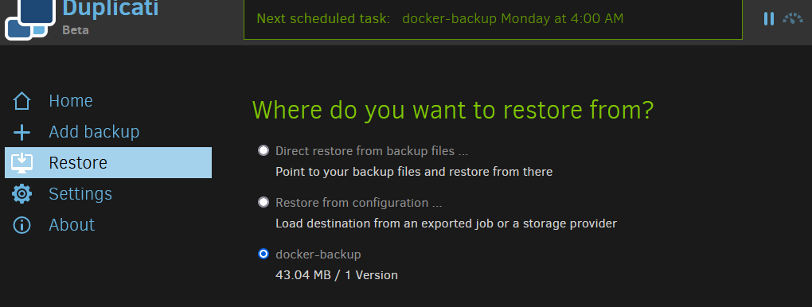
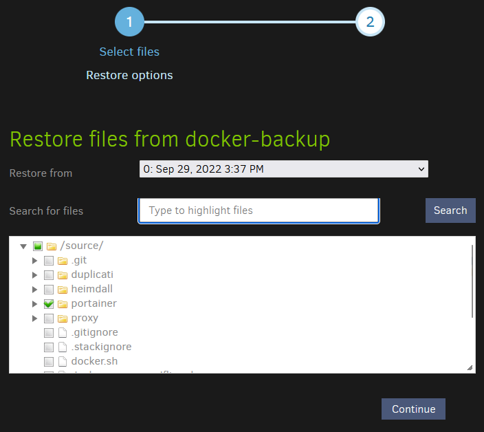
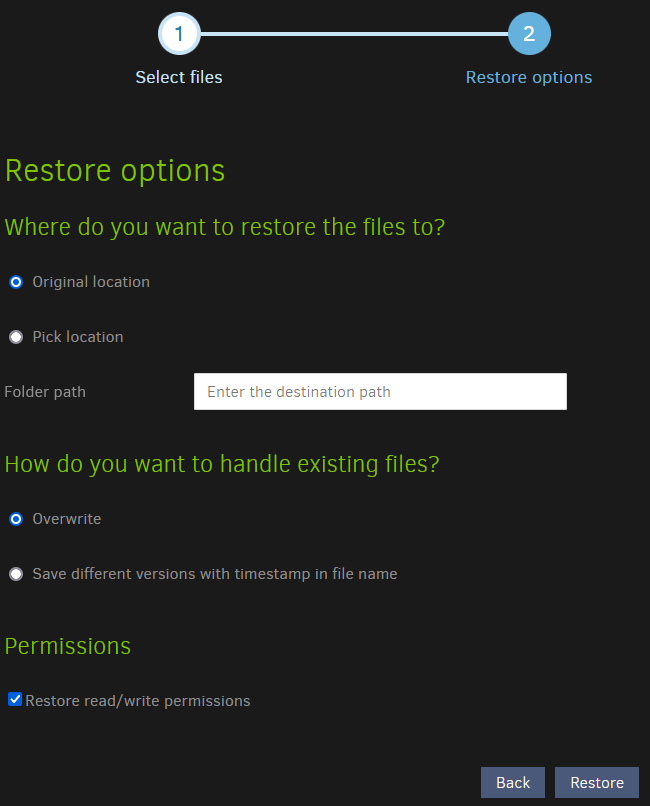

# Source
- [linuxserver.io docs](https://docs.linuxserver.io/images/docker-heimdall)
<div align="left">
      <a href="https://www.youtube.com/watch?v=JoA6Bezgk1c">
         
      </a>
</div>