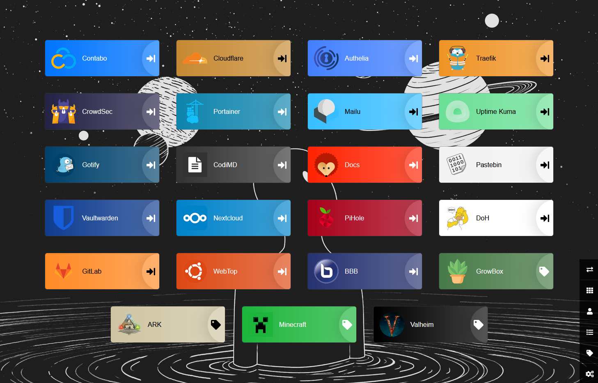

# Heimdall

# Requirements
- Docker
- Docker-compose
- traefik as a reverse proxy in front of it

# Setup
## `.env` file
Change the domain and the time zone in the `.env`.
```yaml
DOMAIN="example.com"
TimeZone='Europe/Berlin'
```
```sh
$ cd heimdall
$ docker-compose up -d
```
or
```sh
./docker.sh -S heimdall -r
```

Done. Now open https://example.com or https://www.example.com


# Source
- [linuxserver.io docs](https://docs.linuxserver.io/images/docker-heimdall)