# Mailu 1.8 with Traefik

## Old documentation: A new version was released: [Mailu 1.9](https://setup.mailu.io/1.9/)
# Learn about SPF, DKIM, DMARC
- [learndmarc](https://www.learndmarc.com/#)

# Setup
### 1. Mailu configuration assistant
Goto https://setup.mailu.io
Do the Mailu configuration:
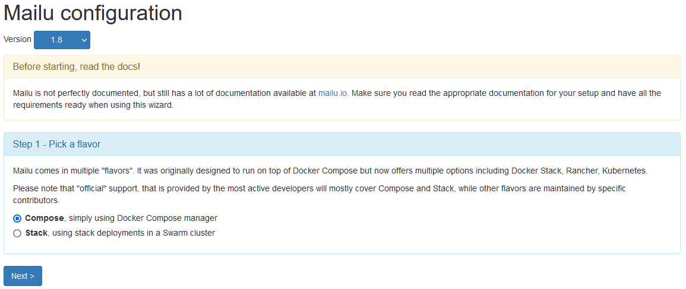
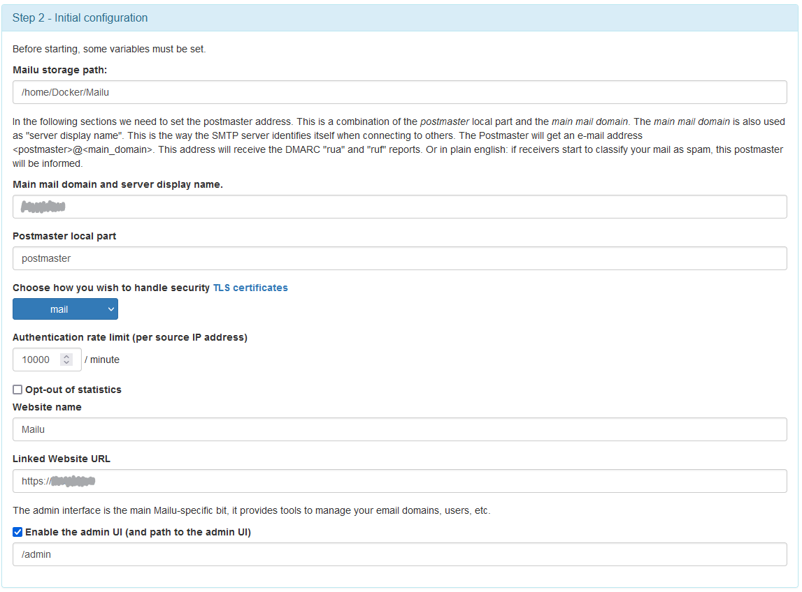
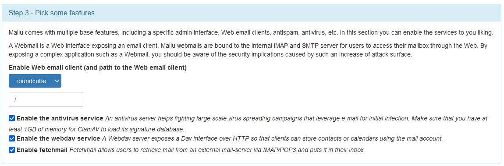
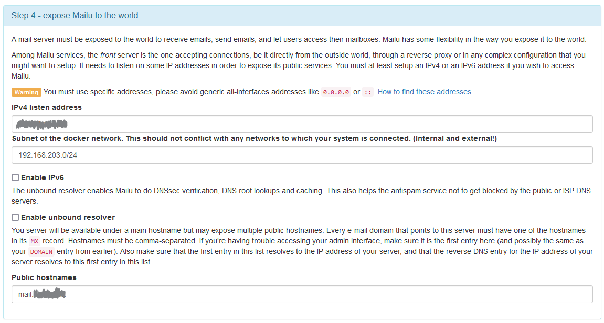
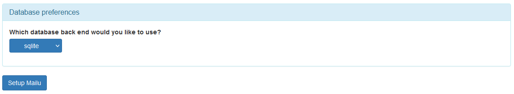

### 2. mailu.env
SSH on your server and executre this commands:
- Replace this link (`https://setup.mailu.io/1.8/file/0000000000000000000000/mailu.env`) with the one from the Mailu configuration (picture below):
-- ```mkdir /home/Docker/Mailu/```
-- ```cd /home/Docker/Mailu/```
-- ```wget https://setup.mailu.io/1.8/file/0000000000000000000000/mailu.env```

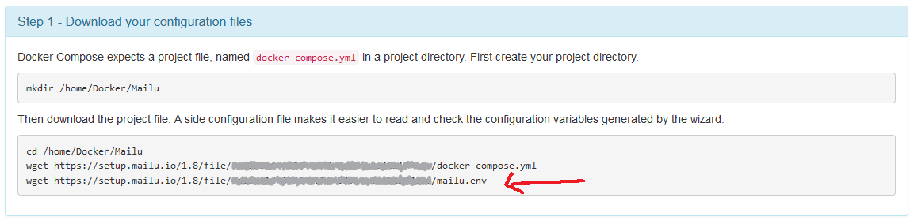

- Change the key:
-- ```sudo apt install pwgen```
-- ```pwgen 16```
```
Bei4aebe0aexuvae egh4BooPhohpaiv0 veeR2ieYoRahngah rie2ieFah6Cosh5u
Oxaa4eedo1oomohn quoh6aephoom5aeB gaixeeQua0Dae3na ahh7lai1Ai4Koox2
xahzeX8iog1oocei ahF8xou2heeyoozi ieR1AhWei6ueghie idoophisai2ohS6a
saiBai9chaephei9 Ahng7Dahqu0iegai loi8og2Aengahqu9 aixe0ahc6jooZaem
quohph7eiZ5Ep8xi tahziePhuzeem1ni oodehiqueig0ahSh isoon1eiphaiSh3u
Ahxai9fahchoo3Ae iehue9miehoHai6g phusee0eepieyoeJ oopaeng5EeHe9eeY
igheiphoH6shuphi ekeesahpiufohPh3 boo3jaingieM2cik the1Phaiweiw9Ohp
...
```
-- Replace the `SECRET_KEY=` in the mailu.env with one of the random generated above
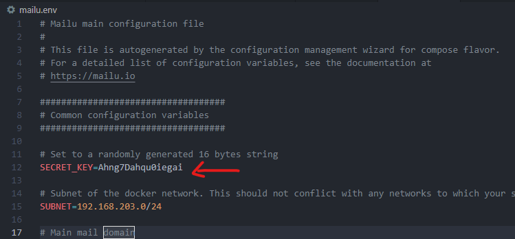


### 3. Docker-compose
Get the ``.env`` and `docker-compose.yml` file from this repo

``.env`` (Defining of variables)
```yml
DOMAIN="example.com"
TraefikPath='../proxy/data/traefik/letsencrypt'
```

Alternavly you can downloade the `docker-compose.yml` from Mailu configuration, like in the picte on step 2 shown. But than you have to configure the docker-compose file for traefik by your selfe.
```wget https://setup.mailu.io/1.8/file/0000000000000000000000/docker-compose.yml```

### 4. Start Mailu
- Start Docker-compose: `docker-compose -s`

- Stop/Remove Container: `docker-compose down`

### 5. Add admin user
Create admin user:
```docker-compose exec admin flask mailu admin USER example.com 'PASSWORD'```

## Configure Mailu
https://mail.example.com/admin
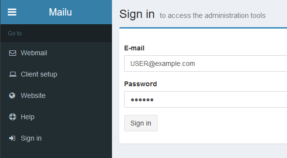


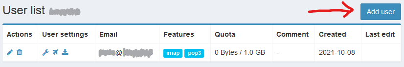

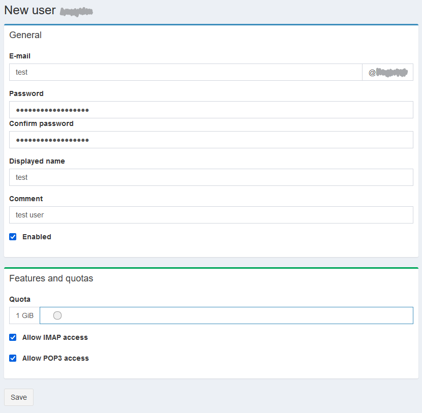


## Configue DNS-Records

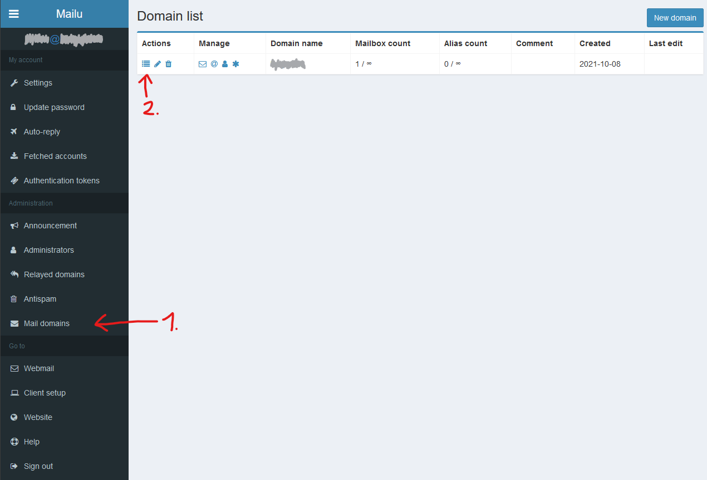

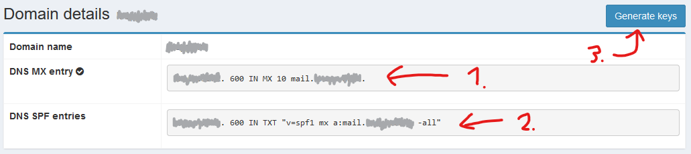

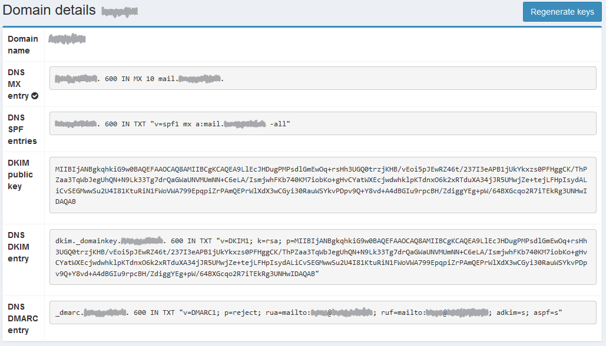


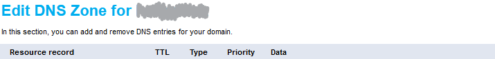
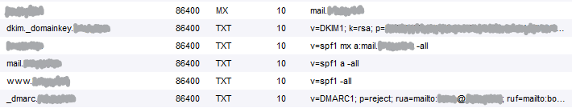

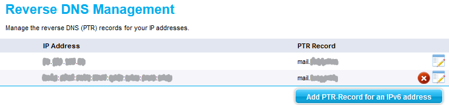

## Test Mail Server

https://mxtoolbox.com/emailhealth/
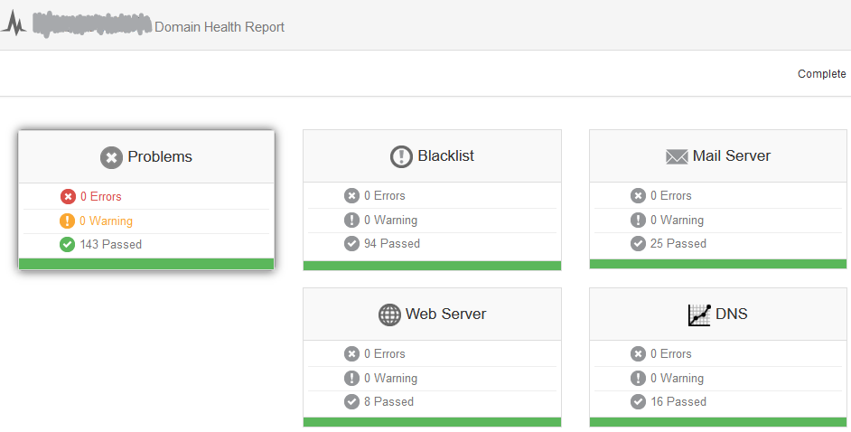


https://mail-tester.com
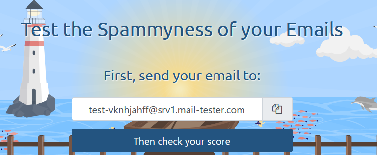

https://www.gmass.co/smtp-test
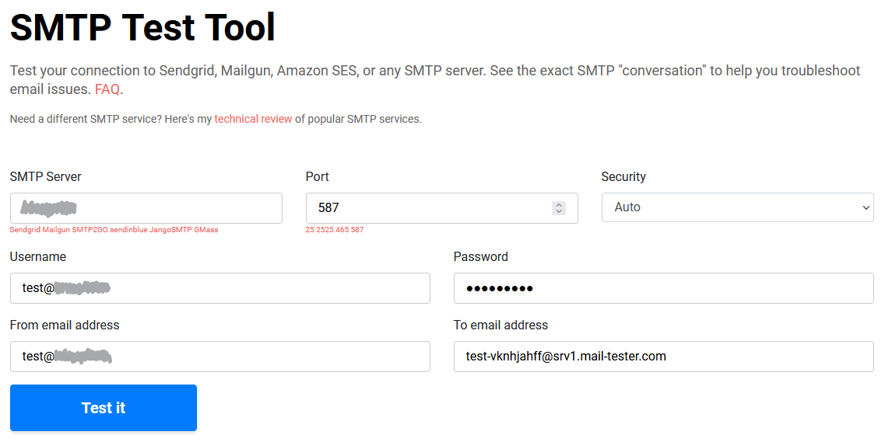

```
Connected to smtp://**********:587/?starttls=when-available
<< 220 mail.://**********: ESMTP ready
>> EHLO [172.31.10.74]
<< 250-mail.://**********:
<< 250-PIPELINING
<< 250-SIZE
<< 250-50000000
<< 250-ETRN
<< 250-ENHANCEDSTATUSCODES
<< 250-8BITMIME
<< 250-DSN
<< 250 STARTTLS
>> STARTTLS
<< 220 2.0.0 Start TLS
>> EHLO [172.31.10.74]
<< 250-mail.://**********:
<< 250-PIPELINING
<< 250-SIZE
<< 250-50000000
<< 250-ETRN
<< 250-ENHANCEDSTATUSCODES
<< 250-8BITMIME
<< 250-DSN
<< 250 AUTH PLAIN LOGIN
>> AUTH PLAIN AHRlc3RAa3JvcHAubGluawAxMjM0NTY3ODk=
<< 235 2.0.0 OK
>> MAIL FROM:<test@://**********:> SIZE=563
>> RCPT TO:<test-vknhjahff@srv1.mail-tester.com>
<< 250 2.1.0 Ok
<< 250 2.1.5 Ok
>> DATA
<< 354 End data with <CR><LF>.<CR><LF>
>> From: test@://**********:
>> Date: Fri, 08 Oct 2021 20:13:14 퍍
>> Subject: SMTP test from ://**********:
>> Message-Id: <L4WBAHJDZEU4.NT80I2KY67MW@WIN-AUIR3RRGP88>
>> To: test-vknhjahff@srv1.mail-tester.com
>> MIME-Version: 1.0
>> Content-Type: multipart/alternative; boundary="=-E/J5P2H2106HKtH4EakxHA=="
>>
>> --=-E/J5P2H2106HKtH4EakxHA==
>> Content-Type: text/plain; charset=utf-8
>>
>> Test message
>> --=-E/J5P2H2106HKtH4EakxHA==
>> Content-Type: text/html; charset=utf-8
>> Content-Id: <L4WBAHJDZEU4.QBFS8BPR2P0R1@WIN-AUIR3RRGP88>
>>
>> <b>Test message</b>
>> --=-E/J5P2H2106HKtH4EakxHA==--
>> .
<< 250 2.0.0 Ok: queued as AFBF4A03D2C 
```
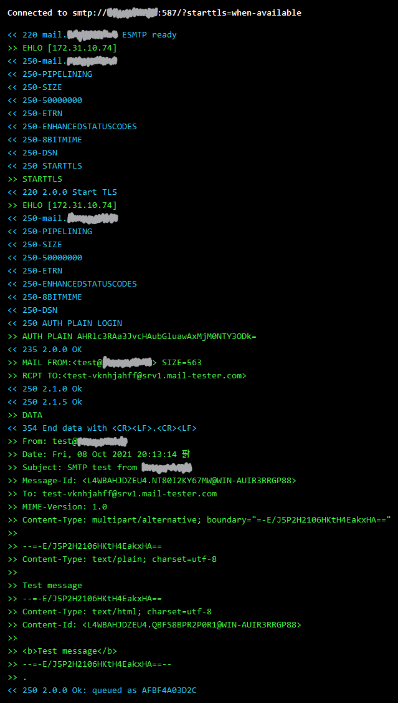


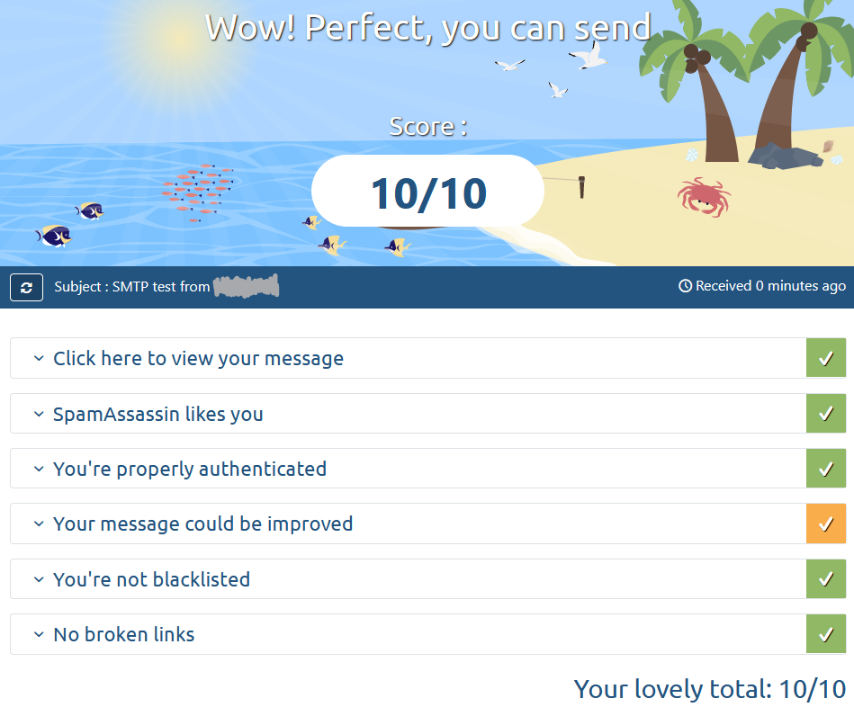

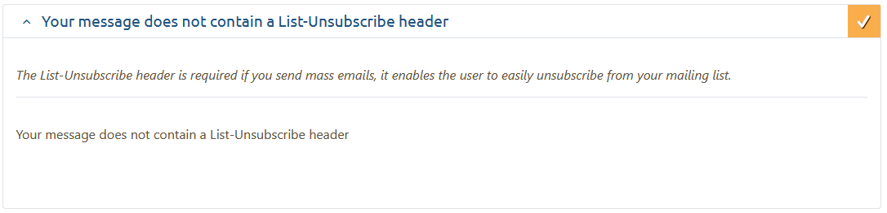


https://www.gmass.co/smtp-test


## Source

<div align="left">
      <a href="https://www.youtube.com/watch?v=LwNOb7Qz-VQ">
         
      </a>
</div>

- [Mailu configuration](https://setup.mailu.io/)
- [Mailu docs](https://mailu.io/1.6/reverse.html)
- [SMTP Test Tool](https://www.gmass.co/smtp-test)
- [Test the Spammyness of your Emails](https://mail-tester.com)
- [Mailu & Traefik](https://github.com/Mailu/Mailu/issues/1038)
- [Traefik as reverse proxy](https://mailu.io/master/reverse.html#traefik-as-reverse-proxy)
- [Mxtoolbox](https://mxtoolbox.com/emailhealth)
- [SPF records for HELO/EHLO names](http://www.open-spf.org/action_browse_id_FAQ/Common_mistakes_revision_26/#helo)
- [Spam Database Query](https://www.uceprotect.net/en/rblcheck.php)