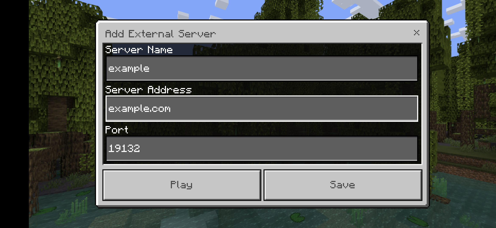
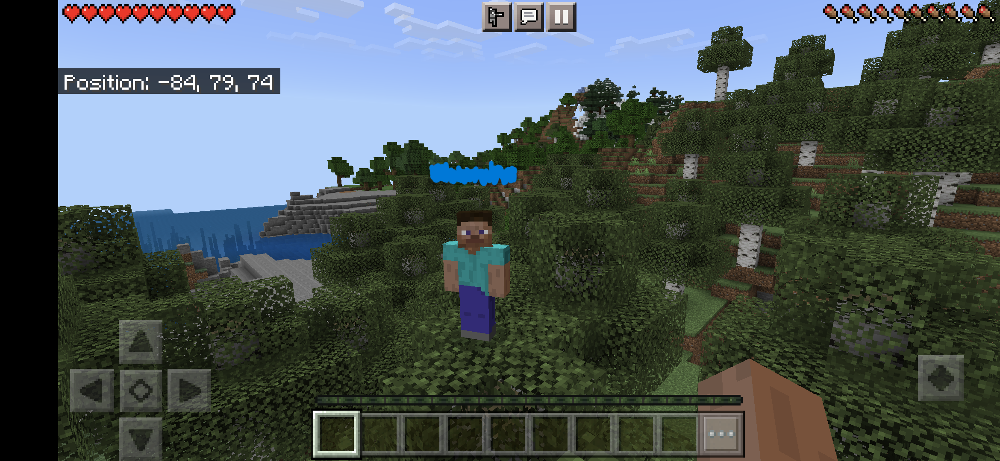

# Minecraft

This will setup 2 Minecraft servers with a `Velocity` proxy and `Geyser-Velocity` and `floodgate-velocity` plugin in front of it. In the end, you will be able to play with all Minecraft versions. This includes Minecraft java edition and Minecraft bedrock edition.

# Requirements
- Docker
- Docker-compose
- traefik as a reverse proxy in front of it


# Setup
## `.env` file
Change the domain in the `.env` file.
```yaml
DOMAIN="example.com"
```
## Create necessary files
```sh
mkdir minecraft/data/filebrowser
touch minecraft/data/filebrowser/filebrowser.db
docker-compose up -d
sleep 100
docker-compose down
sudo chown 1000:1000 minecraft/data -R
cd minecraft/data/minecraft/proxy/plugins/
wget https://ci.opencollab.dev//job/GeyserMC/job/Geyser/job/master/lastSuccessfulBuild/artifact/bootstrap/velocity/build/libs/Geyser-Velocity.jar
wget https://ci.opencollab.dev/job/GeyserMC/job/Floodgate/job/master/lastSuccessfulBuild/artifact/velocity/build/libs/floodgate-velocity.jar
cd ../../../../../
```

## Edit velocity.toml

`nano minecraft/data/proxy/velocity.toml`\
old:
```yaml

# Should we authenticate players with Mojang? By default, this is on.
online-mode = true

# Should the proxy enforce the new public key security standard? By default, this is on.
force-key-authentication = true

...

[servers]
# Configure your servers here. Each key represents the server's name, and the value
# represents the IP address of the server to connect to.
lobby = "127.0.0.1:30066"
factions = "127.0.0.1:30067"
minigames = "127.0.0.1:30068"

# In what order we should try servers when a player logs in or is kicked from a server.
try = [
  "lobby"
]
``` 

new:
```yaml

# Should we authenticate players with Mojang? By default, this is on.
online-mode = false

# Should the proxy enforce the new public key security standard? By default, this is on.
force-key-authentication = false

...

[servers]
# Configure your servers here. Each key represents the server's name, and the value
# represents the IP address of the server to connect to.
lobby = "mc1:25565"
factions = "mc1:25565"
minigames = "mc2:25565"

# In what order we should try servers when a player logs in or is kicked from a server.
try = [
  "lobby"
]
```


## Edit server.properties
`minecraft/data/minecraft/mc1/server.properties` and `minecraft/data/minecraft/mc2/server.properties`
`nano minecraft/data/minecraft/mc1/server.properties`
`nano minecraft/data/minecraft/mc2/server.properties`\
old:
```yaml
online-mode=true
enforce-secure-profile=true
```

new:
```yaml
online-mode=false
enforce-secure-profile=false
```

## Edit config.yml
`nano minecraft/data/minecraft/proxy/plugins/Geyser-Velocity/config.yml`\
old:
```yaml
remote:
  # The IP address of the remote (Java Edition) server
  # If it is "auto", for standalone version the remote address will be set to 127.0.0.1,
  # for plugin versions, it is recommended to keep this as "auto" so Geyser will automatically configure address, port, and auth-type.
  # Leave as "auto" if floodgate is installed.
  address: auto
  # The port of the remote (Java Edition) server
  # For plugin versions, if address has been set to "auto", the port will also follow the server's listening port.
  port: 25565
  # Authentication type. Can be offline, online, or floodgate (see https://github.com/GeyserMC/Geyser/wiki/Floodgate).
  # For plugin versions, it's recommended to keep the `address` field to "auto" so Floodgate support is automatically configured.
  # If Floodgate is installed and `address:` is set to "auto", then "auth-type: floodgate" will automatically be used.
  auth-type: online
```

new:
```yaml
remote:
  # The IP address of the remote (Java Edition) server
  # If it is "auto", for standalone version the remote address will be set to 127.0.0.1,
  # for plugin versions, it is recommended to keep this as "auto" so Geyser will automatically configure address, port, and auth-type.
  # Leave as "auto" if floodgate is installed.
  address: mc
  # The port of the remote (Java Edition) server
  # For plugin versions, if address has been set to "auto", the port will also follow the server's listening port.
  port: 25565
  # Authentication type. Can be offline, online, or floodgate (see https://github.com/GeyserMC/Geyser/wiki/Floodgate).
  # For plugin versions, it's recommended to keep the `address` field to "auto" so Floodgate support is automatically configured.
  # If Floodgate is installed and `address:` is set to "auto", then "auth-type: floodgate" will automatically be used.
  auth-type: floodgate
```

## Start the containers
```sh
$ cd minecraft
$ docker-compose up -d
```
or use the shell script in the root directory of this repo
```sh
./docker.sh -S minecraft -r
```

Done. Now open https://mc-files.example.com and have fun playing on your minecraft server

### One your mobile device:



### One your pc:


### Web interface for files

