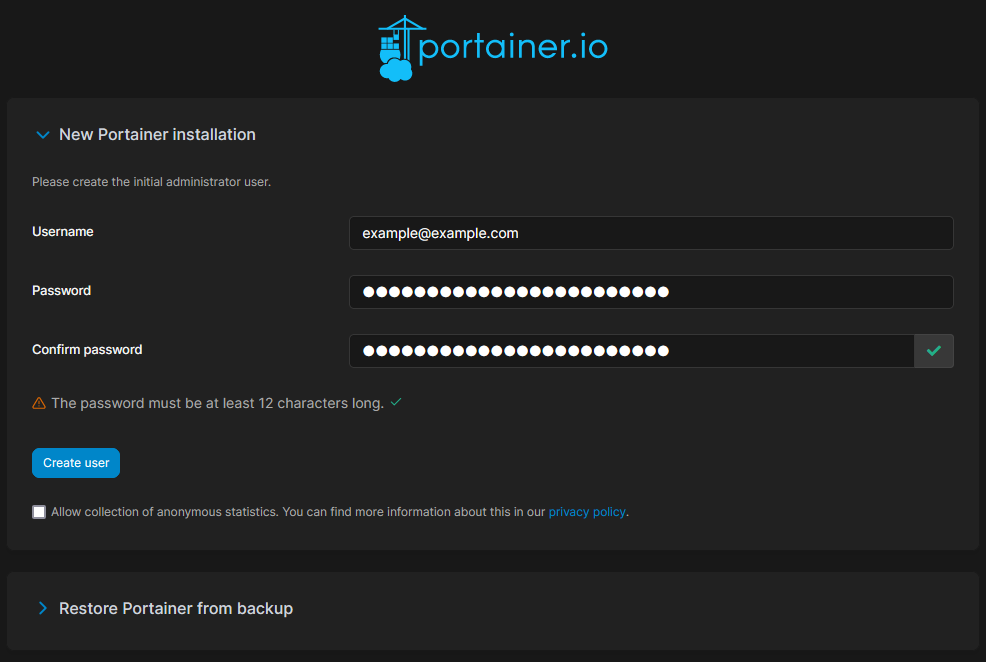
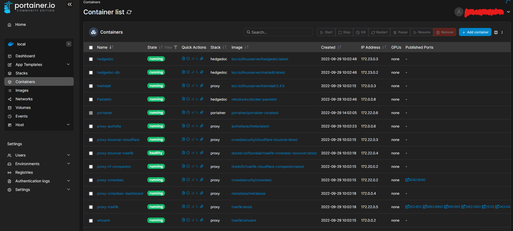

# Portainer

# Requirements
- Docker
- Docker-compose
- traefik as a reverse proxy in front of it

# Setup
## `.env` file
Change the domain in the `.env` file to your domain.
```yaml
DOMAIN="example.com"
```
```sh
$ cd portainer
$ docker-compose up -d
```
or
```sh
./docker.sh -S proxy -r
./docker.sh -S portainer -r
```

Done. Now open https://portainer.example.com



# Source
- [Portainer docs](https://docs.portainer.io/start/install/server/docker/linux)