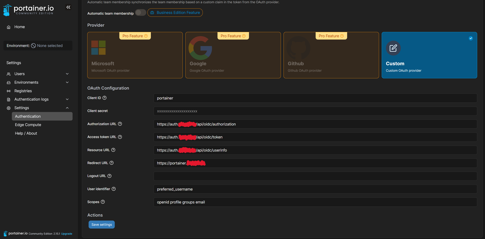
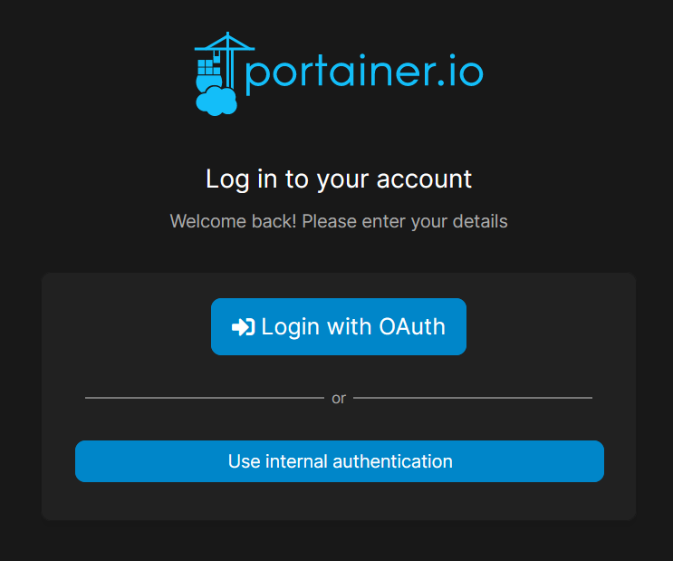
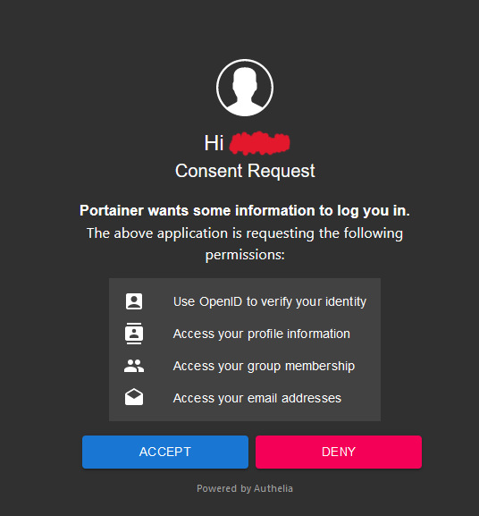

# Portainer

# Requirements
- Docker
- Docker-compose
- traefik as a reverse proxy in front of it

# Setup
## `.env` file
Change the domain in the `.env` file to your domain.
```yaml
DOMAIN="example.com"
```
```sh
$ cd portainer
$ docker-compose up -d
```
or
```sh
./docker.sh -S proxy -r
./docker.sh -S portainer -r
```

Done. Now open https://portainer.example.com


# Advanced
## Add Authelia as OIDC
To log in with Authelia, you first have to log in to Portainer and open the authentication settings. Scroll down and fill out the following information:



`Client ID`: `portainer`\
`Client secret`: `XXXXXXXXXXXXXXXXXXXXXXXX`\
`Authorization URL`: `https://auth.example.com/api/oidc/authorization`\
`Access token URL`: `https://auth.example.com/api/oidc/token`\
`Resource URL`: `https://auth.example.com/api/oidc/userinfo`\
`Redirect URL`: `https://portainer.example.com`\
`Logout URL`: ` `\
`User identifier`: `preferred_username`\
`Scopes`: `openid profile groups email`

In Authelia you have to add this to the identity_providers: and clients: section in the `configuration` file of Authelia:
```yaml
identity_providers:
    ...
    clients:
        ...
        - id: portainer
          description: Portainer wants some information to log you in.
          secret: 'XXXXXXXXXXXXXXXXXXXXXXXXXXXXXXXXXXXXXXXXXXXXXXXXXXXXXXXXXXXXXXXXXXXXXXXXXXXXXXXXXXXXXXXXXXXXXXXXXXXXXXXXXXXXXXXXXXXXXXXXXXXXXXXX'
          public: false
          authorization_policy: two_factor
          audience: []
          scopes:
            - openid
            - profile
            - groups
            - email
          redirect_uris:
            - https://portainer.example.com
          userinfo_signing_algorithm: none
        ...
```

After that the login should look like this:



# Source
- [Portainer docs](https://docs.portainer.io/start/install/server/docker/linux)
- [Authelia docs](https://www.authelia.com/configuration/identity-providers/open-id-connect/)