# Proxy

## Requirements
- You need a public domain
- Your domain has to be registered at Cloudflare.
- You need a server that is reachable from the internet. If you are running this on your home server you have to open ports 80 and 443 in your router. Otherwise traefik maybe isn't able to get the certificates from LetsEncrypt or Cloudflare. 

# Setup
## Create necessary files
If you don't clone this Project you have to create some folders and files.
```sh
mkdir proxy/data/authelia
mkdir proxy/data/authelia/config
touch proxy/data/authelia/config/configuration.yml
mkdir proxy/data/crowdsecurity
mkdir proxy/data/crowdsecurity/cs
touch proxy/data/crowdsecurity/cs/acquis.yaml
mkdir proxy/data/crowdsecurity/bouncer
mkdir proxy/data/crowdsecurity/bouncer/cloudflare
touch proxy/data/crowdsecurity/bouncer/cloudflare/cloudflare-cache.json
touch proxy/data/crowdsecurity/bouncer/cloudflare/cfg.yaml
mkdir proxy/data/crowdsecurity/metabase
cd proxy/data/crowdsecurity/metabase
wget https://crowdsec-statics-assets.s3-eu-west-1.amazonaws.com/metabase_sqlite.zip
unzip metabase_sqlite.zip
rm metabase_sqlite.zip
cd ../../../../
```
Now run it. It won't work but we need to execute some commands on the running container.
```sh
docker-compose up -d
```
## Secrets in `.env`
Edit the `.env` file to configure the environment variables
```yaml
# ...
# Traefik
Cloudflare_Email='example@example.com'                                  #<== Email from Cloudflair
Cloudflar_API_Traefik_Token='xxxxxxxxxxxxxxxxxxxxxxxxxxxxxxxxxxxxx'     #<== API Token (Zone/Zone/Read and Zone/DNS/Edit) https://dash.cloudflare.com/profile/api-tokens

# Cloudflare-Companion - Automatic CNAME DNS Creation
Cloudflar_Zonen_ID='xxxxxxxxxxxxxxxxxxxxxxxxxxxxxxxx'           #<== Zone-id
Cloudflar_API_CfC_Token='xxxxxxxxxxxxxxxxxxxxxxxxxxxxxxxx'      #<== API Token (Zone/DNS/Edit) https://dash.cloudflare.com/profile/api-tokens

# Crowdsec Bouncer Key
Crowdsec_Bouncer_Traefik_API='xxxxxxxxxxxxxxxxxxxxxxxxxxxxxxxx' #<== API Key Crowdsec Bouncer
# ...
```
The next steps will show you where you can get the missing pieces of information above:
### Cloudflar_Zonen_ID:
Get the zone id of your domain from https://dash.cloudflare.com/
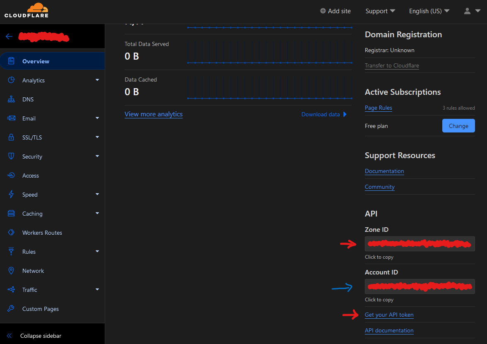

### Cloudflar_API_Traefik_Token
Get the API key from https://dash.cloudflare.com/profile/api-tokens
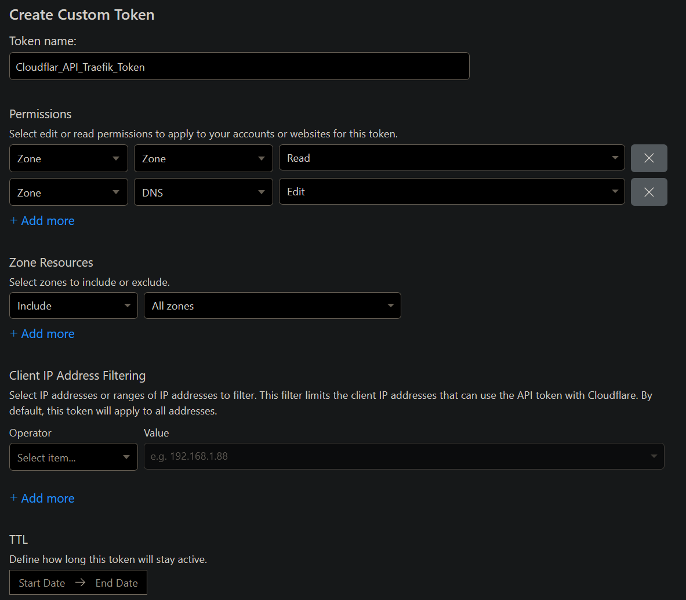
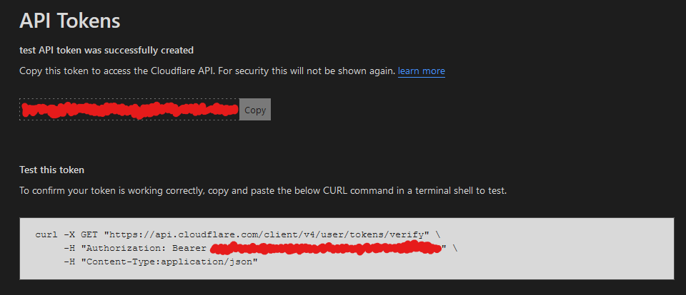

### Cloudflar_API_CfC_Token
Get the API key from https://dash.cloudflare.com/profile/api-tokens
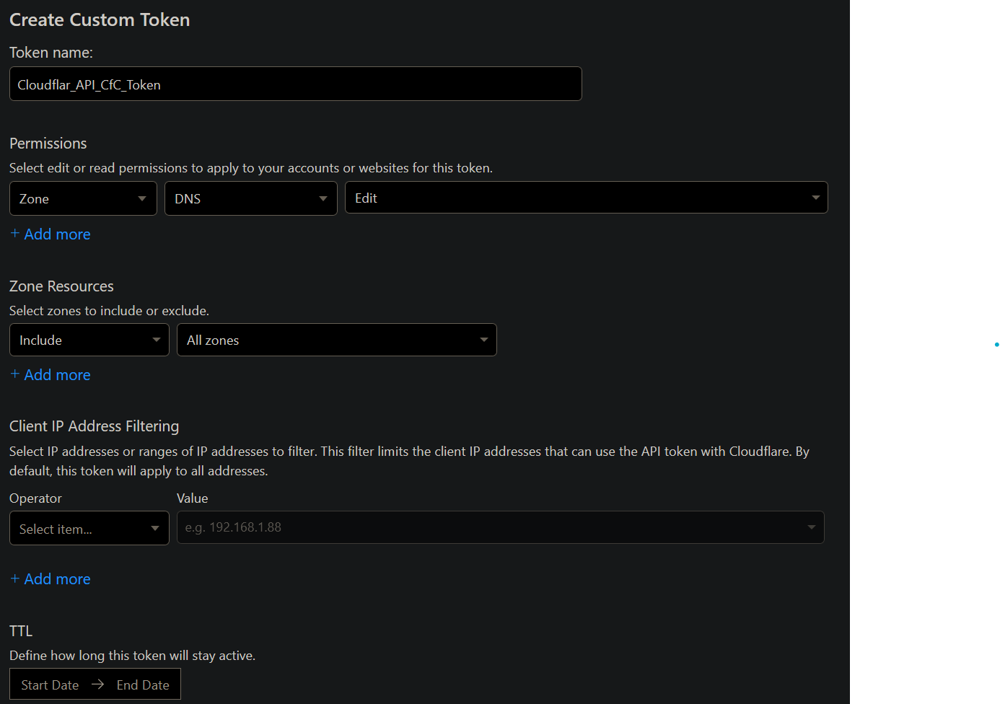


### Traefik_Pilot_Token
Register the traefik instance at https://pilot.traefik.io/ and get the key.
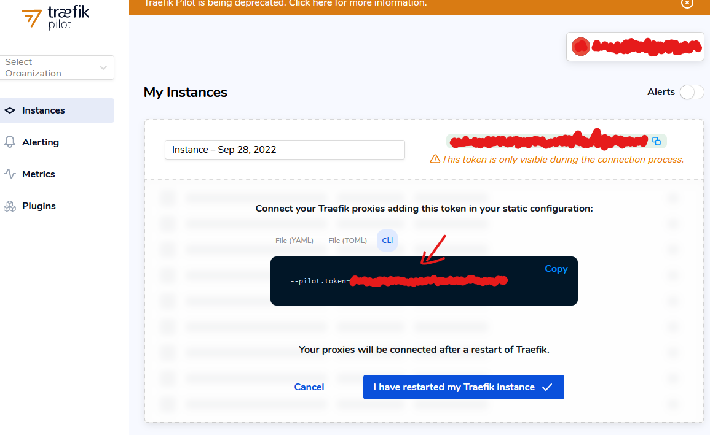

### Traefik_Auth
This step is only necessary if you don't use Authelia. So you still have a password in front of a website.
```sh
$ sudo apt-get install apache2-utils
$ echo $(htpasswd -nb USER PASSWORT) | sed -e s/\\$/\\$\\$/g
USER:$$apr1$$oG7U7xPg$$eq79AxEsQ0Q.YG9h1KxdI0
```

### Crowdsec_Bouncer_Traefik_API
Register the traefik bouncer at the Crowdsec container.
```sh
$ docker exec proxy-crowdsec cscli bouncers add bouncer-traefik
API key for 'bouncer-traefik':

   xxxxxxxxxxxxxxxxxxxxxxxxxxxxxxxx

Please keep this key since you will not be able to retrieve it!
```

# Crowdsec
## setup proxy-crowdsec
```sh
$ nano proxy/data/crowdsecurity/cs/acquis.yaml
```
```yaml
#Generated acquisition file - wizard.sh (service: sshd) / files : /var/log/auth.log
filenames:
  - /var/log/auth.log
labels:
  type: syslog
---

---
#Generated acquisition file - wizard.sh (service: mysql) / files : /var/log/mysql/error.log
filenames:
  - /var/log/mysql/error.log
labels:
  type: mysql
---

---
#Generated acquisition file - wizard.sh (service: linux) / files : /var/log/syslog /var/log/kern.log /var/log/messages
filenames:
  - /var/log/syslog
  - /var/log/kern.log
  - /var/log/messages
labels:
  type: syslog
---

---
filenames:
  - /var/log/traefik/*
labels:
  type: traefik

# source: docker
# container_name:
#   - proxy-traefik
# labels:
#   type: traefik

---
source: docker
container_name:
  - proxy-authelia
labels:
  type: authelia
```
## setup proxy-bouncer-cloudflare
```sh
$ nano proxy/data/crowdsecurity/bouncer/cloudflare/cfg.yaml
```
```yaml
# CrowdSec Config
crowdsec_lapi_url: http://proxy-crowdsec:8080/
crowdsec_lapi_key: 'xxxxxxxxxxxxxxxxxxxxxxxxxxxxxxxx'  #docker exec proxy-crowdsec cscli -oraw bouncers add cloudflarebouncer
crowdsec_update_frequency: 10s

#Cloudflare Config. 
cloudflare_config:
  accounts:
  - id: 'xxxxxxxxxxxxxxxxxxxxxxxxxxxxxxxx'
    token: 'xxxxxxxxxxxxxxxxxxxxxxxxxxxxxxxxxxxxxxxx'
    ip_list_prefix: crowdsec    
    default_action: block    # valid choices are either of challenge, js_challenge, block
    zones:    
    - actions:       
      - block # valid choices are either of challenge, js_challenge, block      
      zone_id: xxxxxxxxxxxxxxxxxxxxxxxxxxxxxxxx

  update_frequency: 30s # the frequency to update the cloudflare IP list 


# Bouncer 
Configdaemon: true
log_mode: file
log_dir: /var/log/ 
log_level: info # valid choices are either debug, info, error 
cache_path: /var/lib/crowdsec/crowdsec-cloudflare-bouncer/cache/cloudflare-cache.json


prometheus:  
  enabled: false  
  # listen_addr: 127.0.0.1  
  # listen_port: 2112
```
The next steps will show you where you can get the missing pieces of information above:
### crowdsec_lapi_key
```sh
$ docker exec proxy-crowdsec cscli -oraw bouncers add cloudflarebouncer
API key for 'cloudflarebouncer':

   xxxxxxxxxxxxxxxxxxxxxxxxxxxxxxxx

Please keep this key since you will not be able to retrieve it!
```

### token
Go to https://dash.cloudflare.com/profile/api-tokens and click on `Create Token` and then `Create Custom Token`
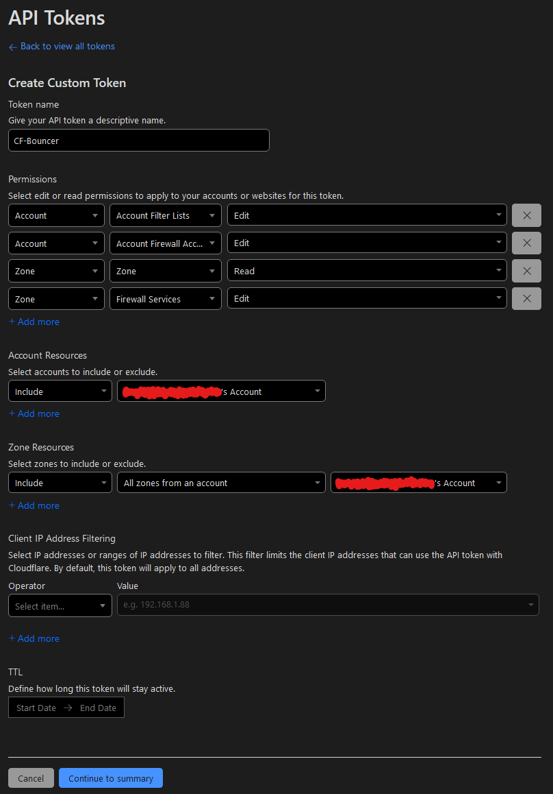


### zone_id and id (Account ID)


# Authelia
```sh
$ nano proxy/data/authelia/config/configuration.yml
```
```yaml
###############################################################
#                   Authelia configuration                    #
###############################################################

server.host: 0.0.0.0
server.port: 9091
log.level: debug
# log:
#   level: debug
#   format: text
#   file_path: "/logs/Authelia.log"
#   keep_stdout: false
theme: dark
# This secret can also be set using the env variables AUTHELIA_JWT_SECRET_FILE
jwt_secret: ---->PUT HERE A SECRET WICH IS 64 CHARACTERS LONG<----
default_redirection_url: https://auth.---->PUT YOUR DOMAIN HERE<----
totp:
  issuer: authelia.com

ntp:
  address: "time.cloudflare.com:123"
  version: 4
  max_desync: 3s
  disable_startup_check: false
  disable_failure: false

# duo_api:
#  hostname: api-123456789.---->PUT YOUR DOMAIN HERE<----
#  integration_key: ABCDEF
#  # This secret can also be set using the env variables AUTHELIA_DUO_API_SECRET_KEY_FILE
#  secret_key: 1234567890abcdefghifjkl

authentication_backend:
  file:
    path: /config/users_database.yml
    password:
      algorithm: argon2id
      iterations: 1
      salt_length: 16
      parallelism: 8
      memory: 64
      
access_control:
  default_policy: two_factor
  networks:
  - name: internal
    networks:
      - '10.0.0.0/8'
      - '172.16.0.0/12'
      - '192.168.0.0/18'
      - '192.168.179.0/24'
      - '172.0.0.1'
  rules:
    - domain:     # Rules applied to everyone 
      - "proxy.---->PUT YOUR DOMAIN HERE<----"
      - "sec.---->PUT YOUR DOMAIN HERE<----"
      policy: two_factor
      subject:
      - "group:admin"

    - domain: 
        - "whoami.---->PUT YOUR DOMAIN HERE<----"
      policy: bypass

    - domain: 
        - "---->PUT YOUR DOMAIN HERE<----"
        - "www.---->PUT YOUR DOMAIN HERE<----"
      policy: one_factor
      subject:
      - "group:admin"
      - "group:user"

session:
  name: authelia_session
  # This secret can also be set using the env variables AUTHELIA_SESSION_SECRET_FILE
  secret: ---->PUT HERE A SECRET WICH IS 128 CHARACTERS LONG<----
  expiration: 3600  # 1 hour
  #inactivity: 3600  # 1 hour
  remember_me_duration: 604800  # 7 days
  domain: ---->PUT YOUR DOMAIN HERE<----  # Should match whatever your root protected domain is

regulation:
  max_retries: 3
  find_time: 120
  ban_time: 300

storage:
  encryption_key: '---->PUT HERE A SECRET WICH IS 128 CHARACTERS LONG<----'
  local:
    path: /config/db.sqlite3

notifier:
   filesystem:
     filename: /config/notification.txt
#  disable_startup_check: true
#  smtp:
#    host: ---->PUT MAIL SERVER HERE<----
#    port: 465 #you maybe have to change this port
#    timeout: 60s
#    username: ---->PUT YOUR MAIL HERE<----
#    password: '---->PUT YOUR MAIL PASSWORT HERE<----'
#    sender: ---->PUT YOUR MAIL HERE<----
#    identifier: ---->PUT MAIL SERVER HERE<----
#    subject: "[Authelia] {title}"
#    startup_check_address: ---->PUT YOUR MAIL HERE<----
#    disable_require_tls: false
#    disable_html_emails: false
#    tls:
#      server_name: ---->PUT MAIL SERVER HERE<----
#      skip_verify: false
#      minimum_version: TLS1.2
```
- Replace all arrows in the `configuration.yml` with your information (---->PUT YOUR DOMAIN HERE<----)

```sh
$ nano proxy/data/authelia/config/users_database.yml
```
```yaml
#docker run authelia/authelia:latest authelia hash-password -- 'password'
users:
    user@example.com:
        password: $argon2id$v=19$m=65536,t=3,p=4$R2dqcnNrOFJMN2F4UElDZw$3wLhazMUu39DaT44gVlc3d/0PPZABwQFXN4ecU/ucM4
        displayname: "test user"
        email: user@example.com
        groups:
            - admin
            - dev
```
You can generate a hash value for the password with the following command. Replace the above one with your own:
```sh
$ docker run authelia/authelia:latest authelia hash-password -- 'password'
Password hash: $argon2id$v=19$m=65536,t=3,p=4$R2dqcnNrOFJMN2F4UElDZw$3wLhazMUu39DaT44gVlc3d/0PPZABwQFXN4ecU/ucM4
```
After this step, everything should be working. Now restart the containers.
```sh
#Restart
./docker.sh -S proxy -s
./docker.sh -S proxy -r
```
### The last step: Register a device for totp
Now open https://auth.example.com and login\
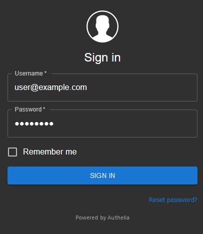

Next press `Register device`\
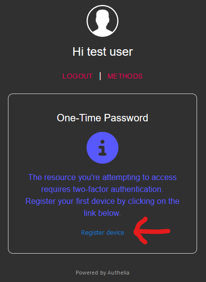

It will say:\
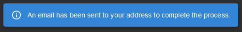\
but in reality, there is no mail. The link to register a new device was written in a file called `notification.txt`
```
cat proxy/data/authelia/config/notification.txt
```
Example output:
```
Date: 2022-09-28 15:59:45.79465267 +0200 CEST m=+27.414134998
Recipient: { user@example.com}
Subject: Register your mobile
Body: This email has been sent to you in order to validate your identity.

If you did not initiate the process your credentials might have been compromised and you should reset your password and contact an administrator.

To setup your 2FA please visit the following URL: https://auth.example.com/one-time-password/register?token=xxxxxxxxxxxxxxxxxxxxxxxxxxxxxxxxxxxxxxxxxxxxxxxxxxxxxxxxxxxxxxxxxxxxxxxxxxxxxxxxxxxxxxxxxxxxxxxxxxxxxxxxxxxxxxxxxxx....

This email was generated by a user with the IP 123.45.678.90.

Please contact an administrator if you did not initiate this process.
```
Now open the link and scan the QR code with a 2-factor app.\
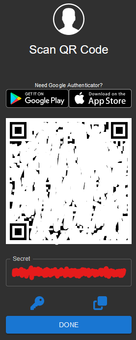

After that, you can now log in with your username, password, and 2fa.\
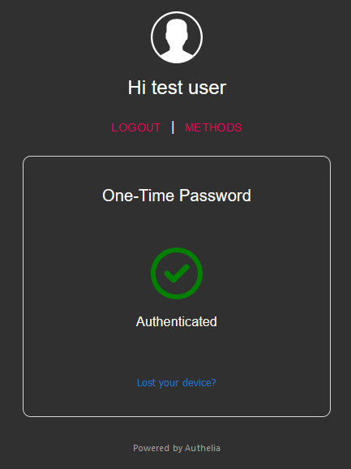

# Done Try it yourself
Open:
- Traefik: https://proxy.Traexample.com/
- Crowdsec: https://sec.Traexample.com/
  - default login for metabase: crowdsec@crowdsec.net and !!Cr0wdS3c_M3t4b4s3??
- Whoami: https://whoami.Traexample.com/

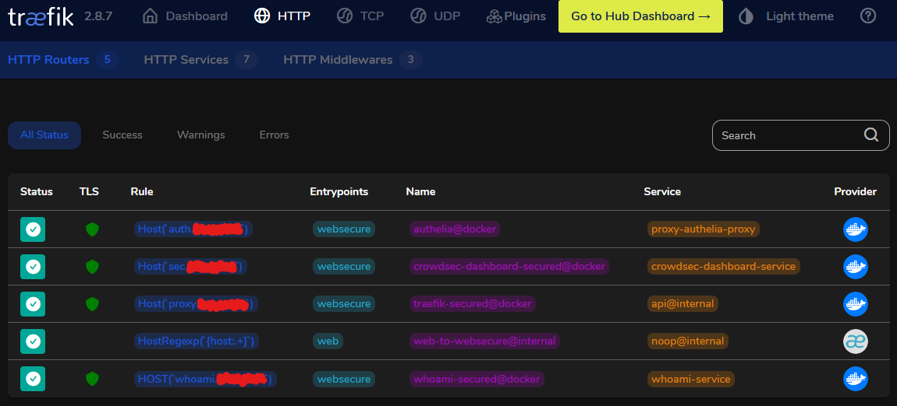\
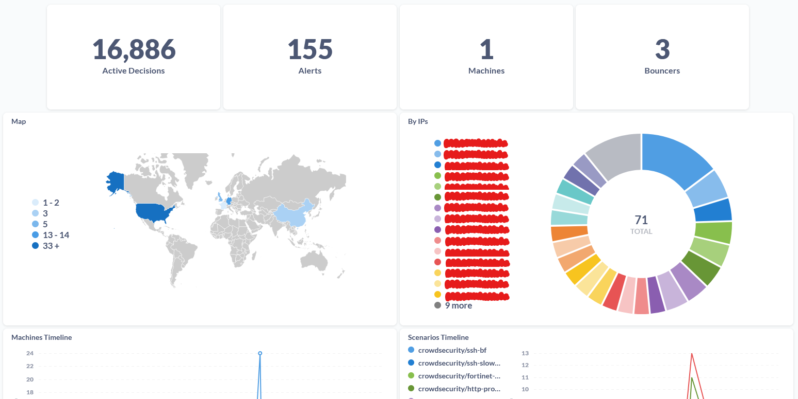\
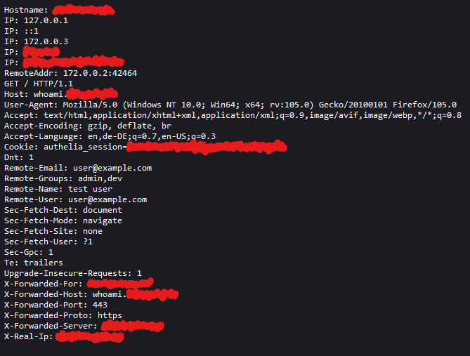\

# Add new container with traefik, crowdsec and authelia
From now on it's pretty simple to add a new web container with traefik as a reverse proxy in front of it and authelia and crowdsec to protect it. You just have to add those lines to the container in the `docker-compose.yml` file:
```yaml
    networks:
      - proxy
    labels:
      - "traefik.enable=true"                                                  #<== Enable traefik
      - "traefik.http.routers.EXAMPLE-secured.rule=Host(`EXAMPLE.${DOMAIN}`)"  #<== Set domain
      - "traefik.http.routers.EXAMPLE-secured.entrypoints=websecure"           #<== Set entry point for HTTPS
      - "traefik.http.routers.EXAMPLE-secured.tls.certresolver=mytlschallenge" #<== Set certsresolvers for https
      - "traefik.http.routers.EXAMPLE-secured.middlewares=authelia"            #<== Add Authelia middlewares to protect login
      - "traefik.http.routers.EXAMPLE-secured.service=EXAMPLE-service"         #<== Set service
      - "traefik.http.services.EXAMPLE-service.loadbalancer.server.port=80"    #<== Set target port on container
```
Now replace the word `EXAMPLE` with the name of the container and replace the destination port in the last line. Example with `whoami`:
```yaml
  whoami:
    image: traefik/whoami
    container_name: whoami
    restart: unless-stopped
    networks:
      - proxy
    labels:
      - "traefik.enable=true"                                                 #<== Enable traefik
      - "traefik.http.routers.whoami-secured.rule=Host(`whoami.${DOMAIN}`)"   #<== Set domain
      - "traefik.http.routers.whoami-secured.entrypoints=websecure"           #<== Set entry point for HTTPS
      - "traefik.http.routers.whoami-secured.tls.certresolver=mytlschallenge" #<== Set certsresolvers for https
      - "traefik.http.routers.whoami-secured.middlewares=authelia"            #<== Add Authelia middlewares to protect login
      - "traefik.http.routers.whoami-secured.service=whoami-service"          #<== Set service
      - "traefik.http.services.whoami-service.loadbalancer.server.port=80"    #<== Set target port on container
```
Now you can reach this container over HTTPS with the domain `whoami.example.com`.

# Source
Traefik:
- [Mau5Machine/docker-compose.yml](https://gist.github.com/Mau5Machine/00401feb19433cf0387cc66c8e90c26c)
- [Traefik documantation](https://doc.traefik.io/traefik/)
<div align="left">
      <a href="https://www.youtube.com/watch?v=liV3c9m_OX8">
         
      </a>
</div>

Crowdsec:
- [crowdsecurity/example-docker-compose](https://github.com/crowdsecurity/example-docker-compose)
- [Crowdsec documantation](https://docs.crowdsec.net/docs/intro)
<div align="left">
      <a href="https://www.youtube.com/watch?v=-GxUP6bNxF0">
         
      </a>
</div>

Authelia:
- [Authelia documantation](https://www.authelia.com/integration/prologue/get-started/)
<div align="left">
      <a href="https://www.youtube.com/watch?v=u6H-Qwf4nZA">
         
      </a>
</div>