# Pterodactyl Game Server Management

Pterodactyl is a robust game server management system that simplifies running game servers. This README provides instructions on setting up and managing servers using Docker.

## Requirements
- Docker
- Docker-compose

## Initial Setup

### `.env` file
Change the `.env` file to your needs.
```yaml
DOMAIN="example.com"
TimeZone='Europe/Berlin'
Email='no-reply@example.com'
EmailPassword='XXXXXXXXXXXXXXXXXXXXXXXX'
Password='Jb4Zos7P^8y3orL$xG*PaMRFYUnTnLEP#opg&e&4S7eUT@yJFAuVJqo54oAAQ%iVSjzu2f4aX9LD5XjwFUxWbgY^47*Z#oEv3r9ny3aiJxfJc%6TPYFgTYSE2&UNcpWc'
```

### Start pterodactyl
```sh
$ cd pterodactyl
$ docker-compose up -d
```
or use the script in the root directory of this repo
```sh
./docker.sh -S proxy -r
./docker.sh -S pterodactyl -r
```

### 1. Creating a User
To start, create a user for the Pterodactyl panel. Run the following commands in your terminal:

```bash
USER@server:/home/Docker-Collection/pterodactyl$ docker-compose run --rm pterodactyl-panel php artisan p:user:mak
Creating pterodactyl_pterodactyl-panel_run ... done
ln: /var/log/panel/logs: File exists
external vars exist.
Checking if https is required.
Using nginx config already in place.
No letsencrypt email is set
Checking database status.
pterodactyl-database (172.26.0.2:3306) open
Migrating and Seeding D.B

   INFO  Nothing to migrate.  

   INFO  Seeding database.  

  Database\Seeders\NestSeeder .............................................................................................................. RUNNING  
  Database\Seeders\NestSeeder ......................................................................................................... 9.22 ms DONE  

  Database\Seeders\EggSeeder ............................................................................................................... RUNNING  
*********************************************
*     Updating Eggs for Nest: Minecraft     *
*********************************************

Updated Paper
Updated Bungeecord
Updated Forge Minecraft
Updated Sponge (SpongeVanilla)
Updated Vanilla Minecraft

*************************************************
*     Updating Eggs for Nest: Source Engine     *
*************************************************

Updated Insurgency
Updated Team Fortress 2
Updated Garrys Mod
Updated Ark: Survival Evolved
Updated Counter-Strike: Global Offensive
Updated Custom Source Engine Game

*************************************************
*     Updating Eggs for Nest: Voice Servers     *
*************************************************

Updated Mumble Server
Updated Teamspeak3 Server

****************************************
*     Updating Eggs for Nest: Rust     *
****************************************

Updated Rust

  Database\Seeders\EggSeeder ........................................................................................................ 829.16 ms DONE  

Starting cron jobs.
Starting supervisord.

 Is this user an administrator? (yes/no) [no]:
 > yes

 Email Address:
 > USER@example.com

 Username:
 > USER

 First Name:
 > USER

 Last Name:
 > NAME

Passwords must be at least 8 characters in length and contain at least one capital letter and number.
If you would like to create an account with a random password emailed to the user, re-run this command (CTRL+C) and pass the `--no-password` flag.

 Password:
 > 

+----------+--------------------------------------+
| Field    | Value                                |
+----------+--------------------------------------+
| UUID     | 5ef005ec-c5c8-4402-a608-0cccd2dca121 |
| Email    | USER@example.com                     |
| Username | USER                                 |
| Name     | USER NAME                            |
| Admin    | Yes                                  |
+----------+--------------------------------------+
```

Follow the on-screen instructions to complete the user creation process, ensuring you have administrative privileges.

### 2. Access the Admin Panel

Now, navigate to your admin panel at https://game.example.com/admin. Here you can manage your servers and configurations.

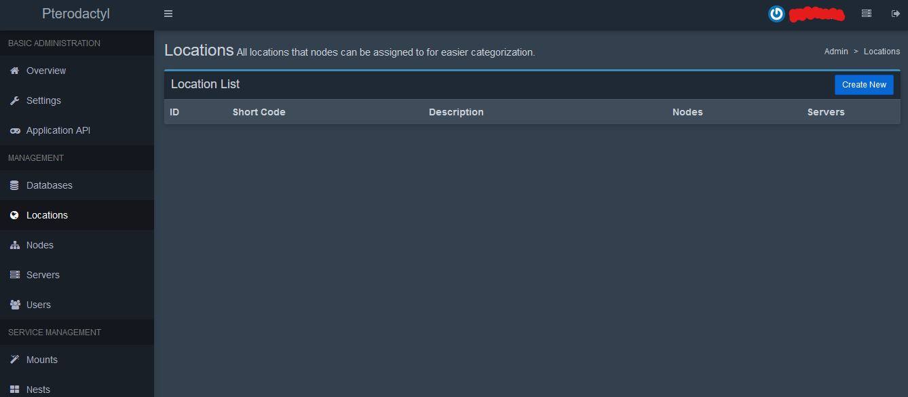

### 3. Configure the Server
Follow these steps for server configuration:

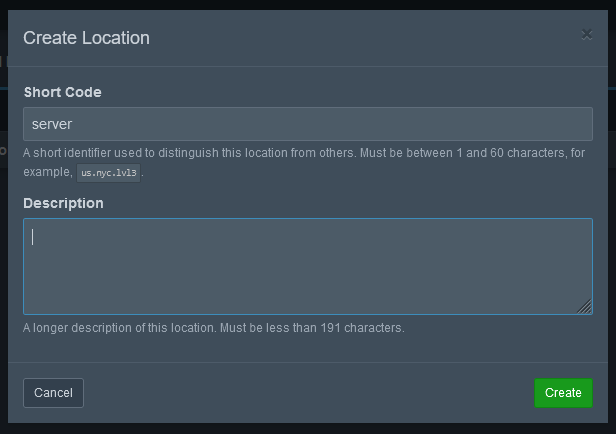

Create a Node:

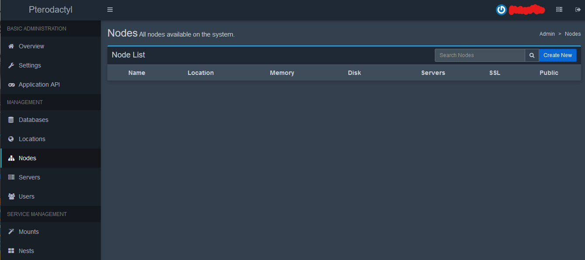

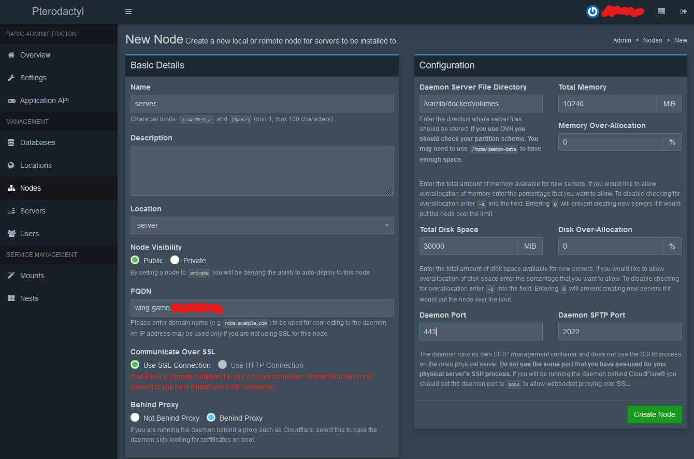

Assign New Allocations:

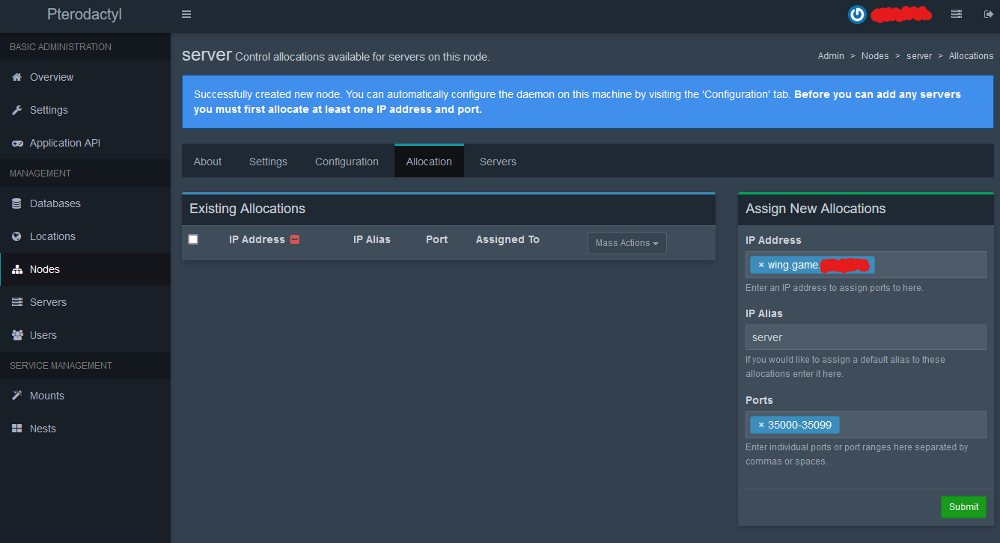

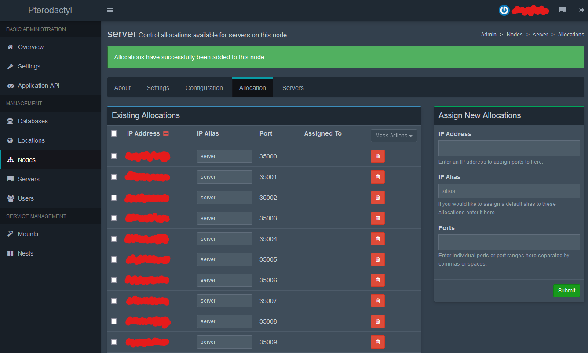

Node Configuration: Copy the Configuration File from Nodes/Configuration.

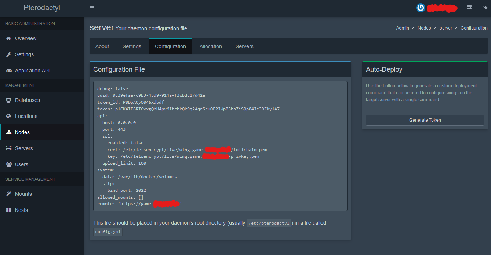

Create a new file in pterodactyl/data/wings/config.yml and paste the Configuration File you just copied:
```bash
USER@server:/home/Docker-Collection/pterodactyl$ sudo chown 1000:1000 data/wings -R
[sudo] password for USER: 
USER@server:/home/Docker-Collection/pterodactyl$ nano data/wings/config.yml
```
```yaml
debug: false
uuid: 0c39efaa-c9b3-45d9-914a-f3cbdc17d42e
token_id: P0DpA0yO046Xdbdf
token: plCK4IE6RT6vxgQbH4pvMItrbkQk9q2AqrSruOF2JWpB3baZiSQp84JeJDZkylA7
api:
  host: 0.0.0.0
  port: 443
  ssl:
    enabled: false
    cert: /etc/letsencrypt/live/wing.game.example.com/fullchain.pem
    key: /etc/letsencrypt/live/wing.game.example.com/privkey.pem
  upload_limit: 100
system:
  data: /var/lib/docker/volumes
  sftp:
    bind_port: 2022
allowed_mounts: []
remote: 'https://game.example.com'
```

Now go to https://game.example.com/admin/nodes and you should see a green hart:
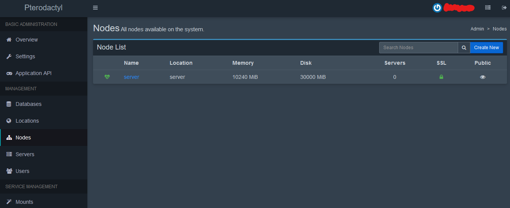

### Creating Your First Game Server
Go to Servers and create a new server:
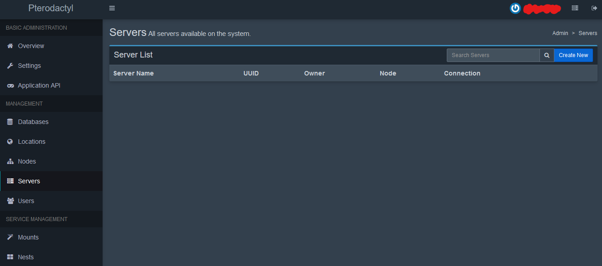
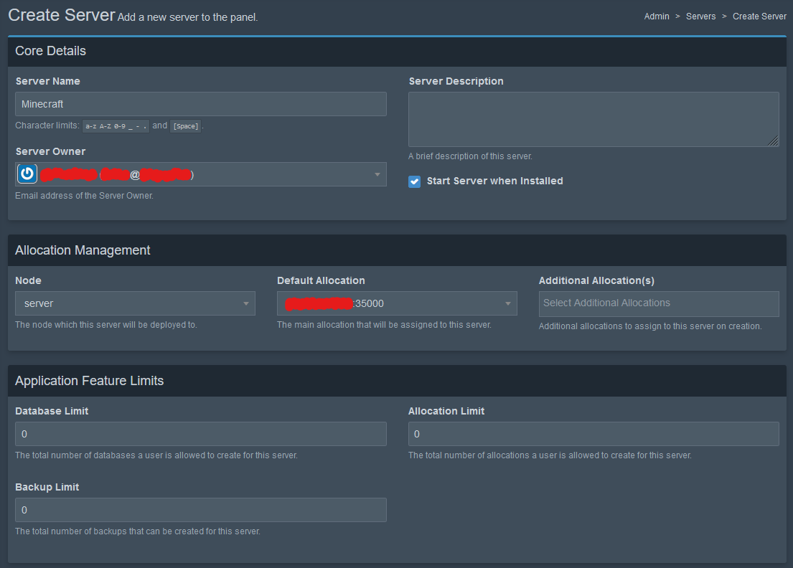
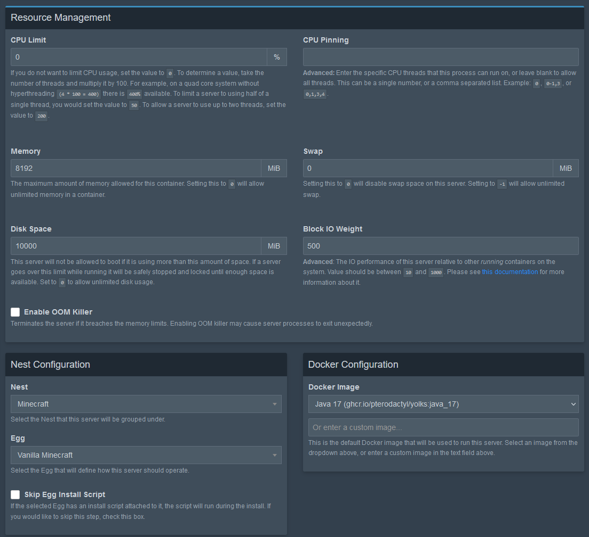
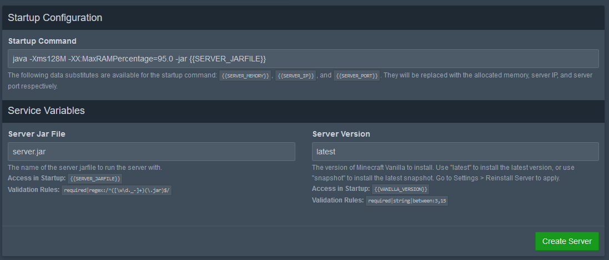
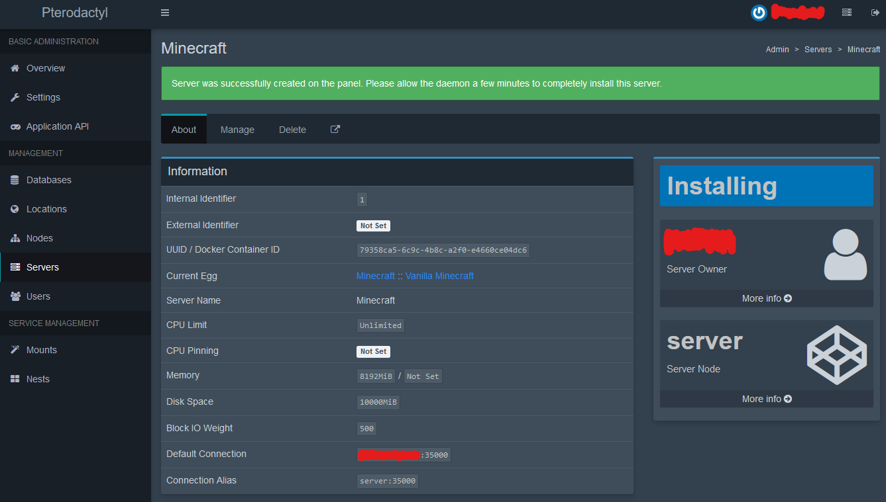

Now go to Servers and click on the spanner of the server you just created:
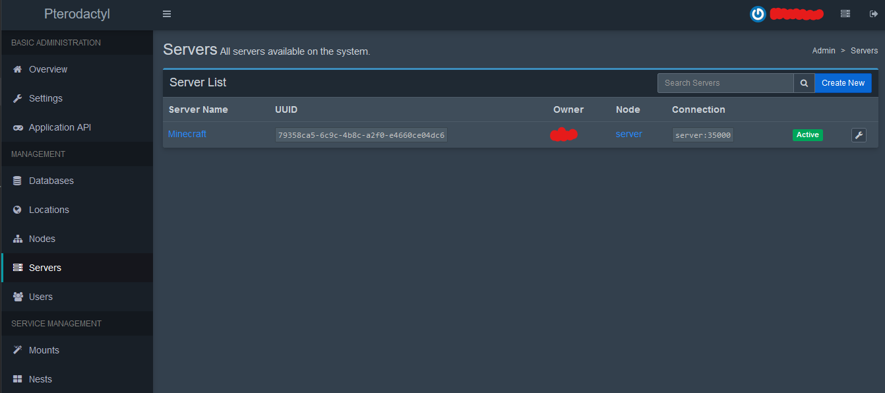
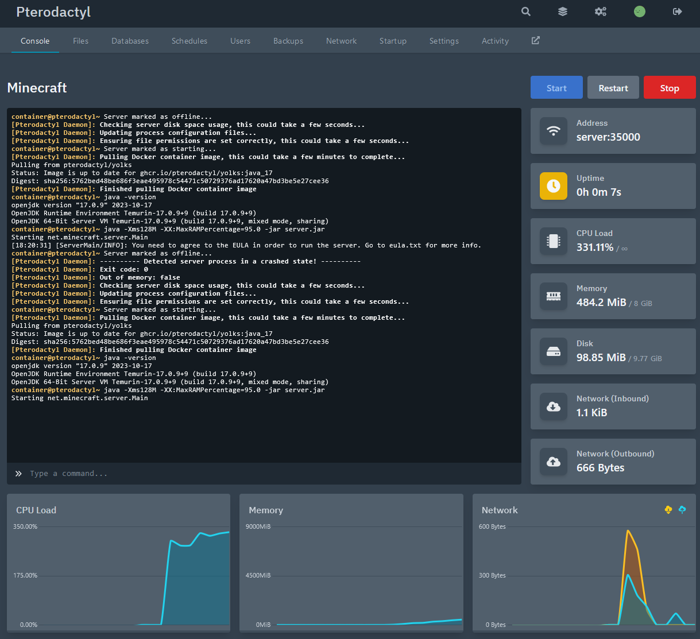

Thats it. Start the Server and connect to it with the IP or the domain with the port 35000. IMPORTEND. Dont use cloudflare tunnel for this. It wont work. Use a normal A record.