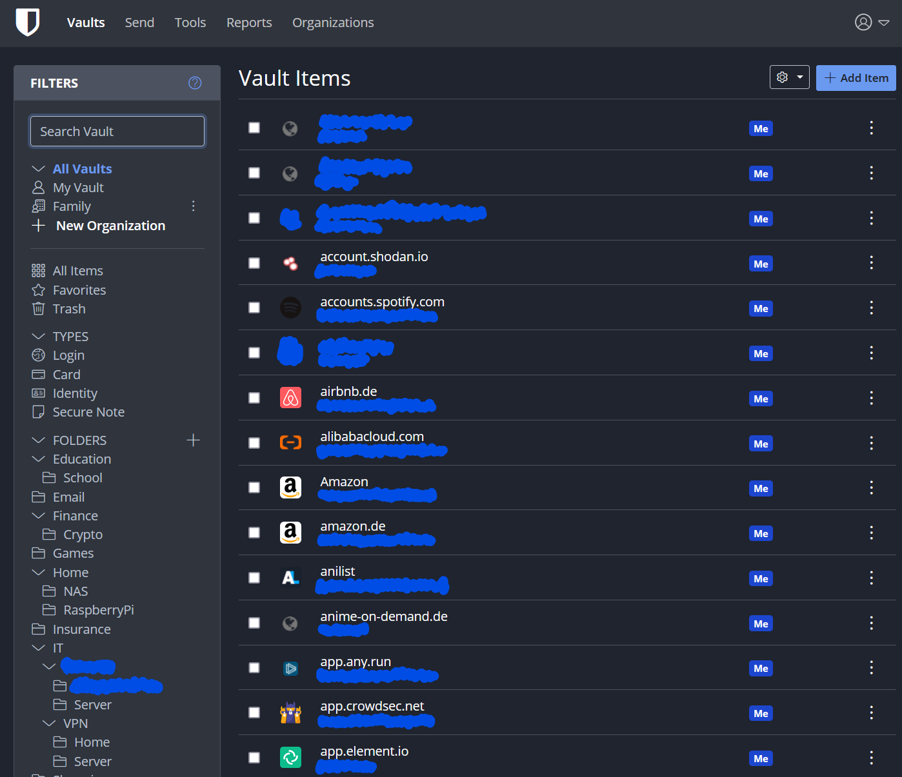
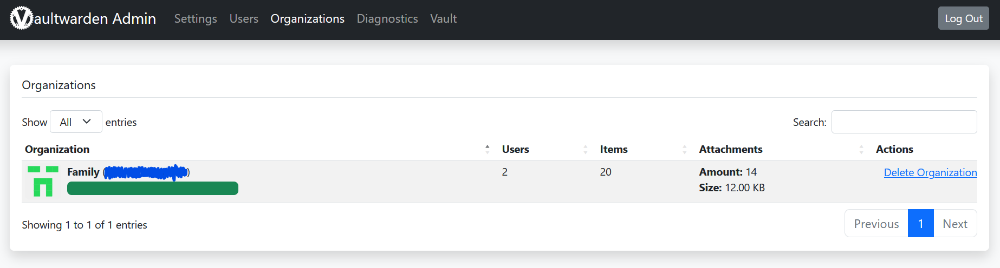

# Vaultwarden

# Requirements
- Docker
- Docker-compose
- traefik as a reverse proxy in front of it

# Setup
## `.env` file
Change the variables in the `.env` file to your need.
```yaml
DOMAIN="example.com"
TimeZone='Europe/Berlin'
BW_ADMIN_TOKEN='XXXXXXXXXXXXXXXXXXXXXXXXXXXXXXXXXXXXXXXXXXXXXXXXXXXX'
```
```sh
$ cd vaultwarden
$ docker-compose up -d
```
or
```sh
./docker.sh -S proxy -r
./docker.sh -S vaultwarden -r
```

Done. Now open https://vault.example.com


- https://bitwarden.com/help/getting-started-webvault/

## Admin panel
Open https://vault.example.com/admin




## Addons
- https://bitwarden.com/help/getting-started-browserext/
## Desktop App
- https://bitwarden.com/help/getting-started-desktop/
## App
- https://bitwarden.com/help/getting-started-mobile/
# Source
- [Vaultwarden GitHub](https://github.com/dani-garcia/vaultwarden)